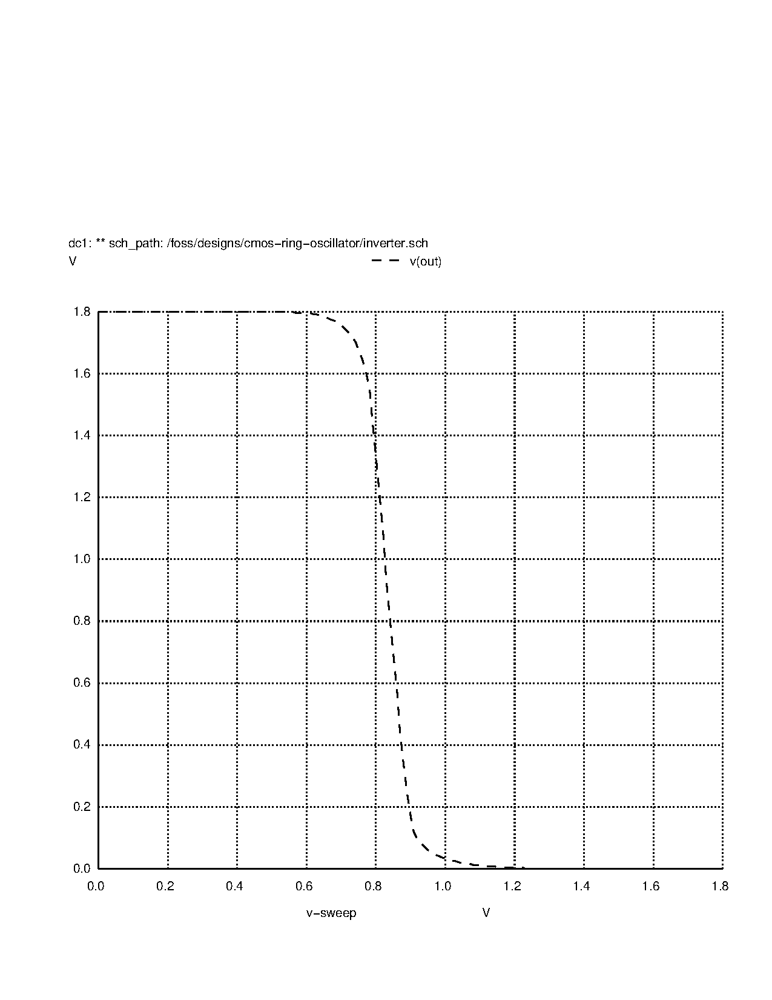
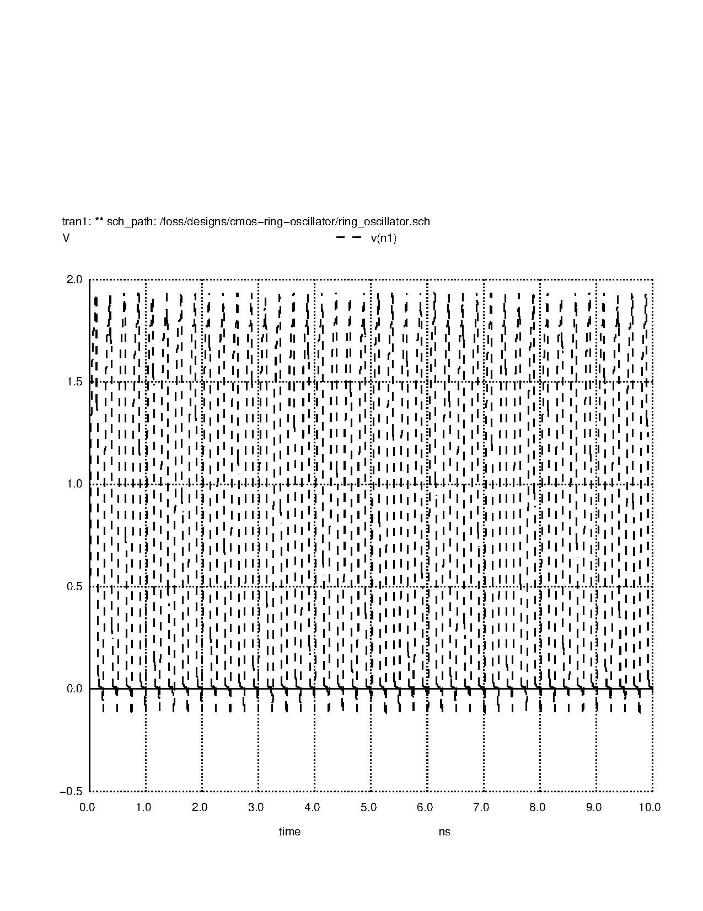
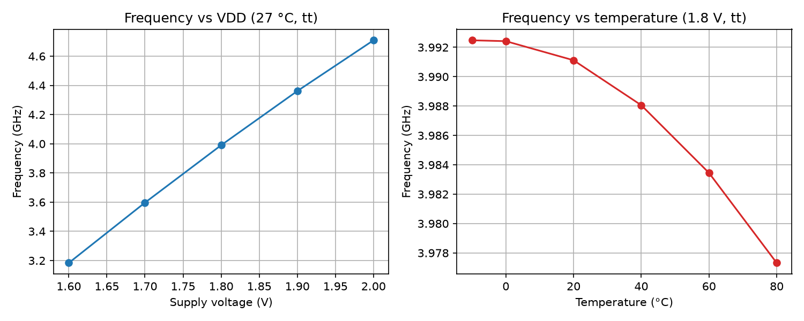
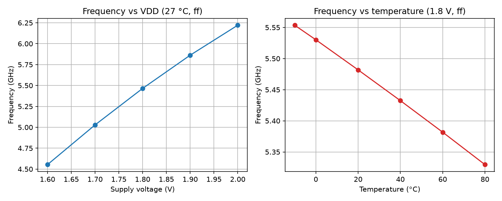
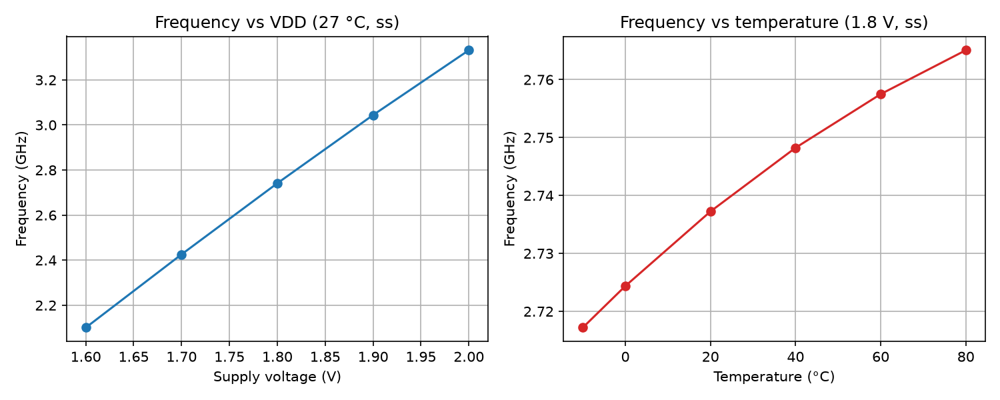

# CMOS Ring Oscillator — Simulation Report

A 5-stage CMOS ring oscillator designed and simulated with **Xschem**, **ngspice**, and the **SkyWater Sky130 (sky130A) open PDK**. This report documents the design, the inverter characterization, the oscillation results, and the corner/sensitivity analysis performed in simulation.

## 1. Overview

A ring oscillator is a loop of an odd number of CMOS inverters. Because the signal is inverted an odd number of times as it travels around the loop, no stable state exists — the circuit oscillates on its own, without any input clock. The oscillation frequency is set by the number of stages `N` and the propagation delay `t_pd` of a single inverter:

```
f = 1 / (2 × N × t_pd)
```

The factor of 2 appears because the signal must travel around the ring twice (a full high→low→high cycle) to complete one oscillation period.

This project follows the step-by-step guide in [`cmos_ring_oscillator_guide.md`](cmos_ring_oscillator_guide.md):

1. Design and characterize a single CMOS inverter (VTC, switching threshold, propagation delay).
2. Build a 5-stage ring oscillator from that inverter.
3. Simulate the oscillation and compare the measured frequency with the hand calculation.
4. Run corner and sensitivity analysis (supply voltage, temperature, process corners).

## 2. Design Description

### 2.1 The Inverter

The inverter uses one PMOS and one NMOS transistor from the Sky130 high-density 1.8 V library (`sky130_fd_pr__pfet_01v8` / `sky130_fd_pr__nfet_01v8`):

| Parameter | Value |
|---|---|
| Channel length `L` | 0.15 µm |
| Channel width `W` (both devices) | 1.0 µm |
| Number of fingers `nf` | 1 |
| Supply voltage `VDD` | 1.8 V |

Schematic: [`inverter.sch`](inverter.sch), symbol: [`inverter.sym`](inverter.sym).

### 2.2 The Ring Oscillator

Five copies of the inverter are connected in a loop: the output of each stage feeds the input of the next, and the output of stage 5 (`n5`) feeds back into the input of stage 1 (`n1`). All stages share the `VDD` and `GND` nets. An initial condition (`.ic v(n1)=0`) is applied to kick-start the oscillation.

Schematic: [`ring_oscillator.sch`](ring_oscillator.sch).

## 3. Inverter Characterization

### 3.1 Voltage Transfer Curve (VTC) and Switching Threshold

A DC sweep of the input from 0 V to 1.8 V produces the VTC. The output starts near 1.8 V for a low input and falls to near 0 V for a high input, confirming correct inverter behavior.



The switching threshold — the input voltage at which the output crosses half the supply — is:

```
V_TH = 0.833 V   (46% of VDD)
```

The threshold sits slightly below the ideal mid-supply point (0.9 V), which is consistent with the PMOS and NMOS being equally sized: the PMOS is intrinsically weaker than the NMOS at equal width.

### 3.2 Propagation Delay

A transient simulation with a fast input pulse gives the two edge delays and the average propagation delay:

| Quantity | Value |
|---|---|
| High-to-low delay `t_phl` | 15.07 ps |
| Low-to-high delay `t_plh` | 29.15 ps |
| Average propagation delay `t_pd` | 22.11 ps |

The rising edge is roughly twice as slow as the falling edge (`t_plh ≈ 2 × t_phl`), again reflecting the weaker PMOS pull-up at equal device widths.

## 4. Ring Oscillator Simulation

### 4.1 Hand Calculation vs. Simulation

Using the measured inverter delay, the expected frequency is:

```
f_est = 1 / (2 × 5 × 22.11 ps) = 4.52 GHz   (period = 221.1 ps)
```

A transient simulation of the ring (tt corner, 1.8 V, 27 °C) gives the waveform below.



| Quantity | Estimated | Simulated | Difference |
|---|---|---|---|
| Frequency | 4.52 GHz | 3.99 GHz | −12% |
| Period | 221.1 ps | 250.6 ps | +13% |
| Effective stage delay (`period/10`) | 22.11 ps | 25.1 ps | +13% |

The simulated frequency is about **12% lower** than the hand calculation. This is expected: the estimate uses the delay of a single inverter measured with an ideal, fast input pulse, whereas in the ring every stage is driven by the finite-slope output of the previous stage, which adds extra delay (the effective per-stage delay in the ring is 25.1 ps instead of 22.11 ps).

## 5. Corner and Sensitivity Analysis

The simulation script in `ring_oscillator.sch` sweeps the supply voltage (1.6–2.0 V at 27 °C), the temperature (−10 °C to 80 °C at 1.8 V), and the process corner (ss / tt / ff). Raw data is in `simulations/freq_vs_vdd_*.txt` and `simulations/freq_vs_temp_*.txt`; plots were generated with [`simulations/plot_sweeps.py`](simulations/plot_sweeps.py).

### 5.1 Supply Voltage Sensitivity (27 °C)

| VDD (V) | ss (GHz) | tt (GHz) | ff (GHz) |
|---|---|---|---|
| 1.6 | 2.101 | 3.184 | 4.553 |
| 1.7 | 2.426 | 3.597 | 5.028 |
| 1.8 | 2.741 | 3.990 | 5.465 |
| 1.9 | 3.044 | 4.362 | 5.862 |
| 2.0 | 3.332 | 4.709 | 6.221 |







The frequency rises steeply with supply voltage — about **3.8 GHz per volt** around the nominal point (≈ **96 %/V** at the tt corner). Higher VDD means stronger transistor drive, shorter delays, and therefore a higher oscillation frequency. This strong dependence is what makes a ring oscillator useful as a voltage sensor.

### 5.2 Temperature Sensitivity (1.8 V)

| Temp (°C) | ss (GHz) | tt (GHz) | ff (GHz) |
|---|---|---|---|
| −10 | 2.717 | 3.992 | 5.554 |
| 0 | 2.724 | 3.992 | 5.530 |
| 20 | 2.737 | 3.991 | 5.482 |
| 40 | 2.748 | 3.988 | 5.432 |
| 60 | 2.758 | 3.983 | 5.382 |
| 80 | 2.765 | 3.977 | 5.330 |

| Corner | Temperature coefficient |
|---|---|
| tt | −0.17 MHz/°C (−42 ppm/°C) |
| ff | −2.49 MHz/°C (−454 ppm/°C) |
| ss | +0.53 MHz/°C (+194 ppm/°C) |

Two observations stand out:

- The **tt corner is remarkably flat** with temperature (≈ −42 ppm/°C), while the ff corner drops noticeably and the ss corner *rises* with temperature.
- The **sign of the temperature coefficient flips between corners**. In strong inversion (ff), the mobility degradation at high temperature dominates and the frequency falls. In the slow corner the devices operate closer to weak inversion, where the threshold-voltage drop with temperature dominates and the frequency rises. This sign flip is a well-known CMOS behavior and is worth keeping in mind if the oscillator is used as a temperature sensor.

### 5.3 Process Corner Spread (1.8 V, 27 °C)

| Corner | Frequency |
|---|---|
| ss (slow) | 2.741 GHz |
| tt (typical) | 3.990 GHz |
| ff (fast) | 5.465 GHz |

The fast corner oscillates at almost exactly **2×** the slow corner (ff/ss = 1.99). Manufacturing variation alone can therefore shift the frequency by nearly a factor of two, which is why ring oscillators are such sensitive process monitors.

## 6. Summary of Results

| Result | Value |
|---|---|
| Switching threshold `V_TH` | 0.833 V (46% of VDD) |
| Inverter propagation delay `t_pd` | 22.11 ps |
| Estimated ring frequency | 4.52 GHz |
| Simulated ring frequency (tt, 1.8 V, 27 °C) | 3.99 GHz |
| Estimate vs. simulation | −12% |
| Voltage sensitivity (tt, at 1.8 V) | ≈ 3.8 GHz/V (≈ 96 %/V) |
| Temperature sensitivity (tt) | −42 ppm/°C |
| Process spread (ff/ss) | 1.99× |

## 7. Project Structure

```
├── README.md                  ← this report
├── cmos_ring_oscillator_guide.md   ← step-by-step project guide
├── note.md                    ← measured values collected during the work
├── inverter.sch / inverter.sym    ← inverter schematic and symbol
├── ring_oscillator.sch        ← 5-stage ring oscillator + sweep script
└── simulations/
    ├── inverter.spice         ← netlist for the inverter
    ├── ring_oscillator.spice  ← netlist for the ring oscillator
    ├── vtc.png                ← inverter voltage transfer curve
    ├── ring.png               ← oscillation waveform
    ├── freq_vs_vdd_{ss,tt,ff}.txt   ← voltage sweep data
    ├── freq_vs_temp_{ss,tt,ff}.txt   ← temperature sweep data
    ├── sweeps_{ss,tt,ff}.png  ← sensitivity plots
    └── plot_sweeps.py         ← plotting script
```

## 8. How to Reproduce

The simulations run in the [IIC-OSIC-TOOLS](https://github.com/iic-jku/IIC-OSIC-Tools) Docker container (Xschem + ngspice + sky130A PDK):

1. Open `ring_oscillator.sch` in Xschem.
2. Run **Simulation → Netlist and Simulate**.
3. The embedded ngspice script runs the transient, VDD sweep, and temperature sweep, and writes `freq_vs_vdd.txt` / `freq_vs_temp.txt` (rename per corner as needed).
4. Re-run the sweep with the `ss` and `ff` corners by changing the `.lib` line in the code block.
5. Regenerate the plots with `python3 plot_sweeps.py`.

## 9. Conclusion

The project successfully demonstrates a working 5-stage CMOS ring oscillator in the Sky130 process:

- The inverter is well-behaved, with a switching threshold near mid-supply and a 22 ps average propagation delay.
- The ring oscillates at 3.99 GHz, within 12% of the hand calculation — the difference is explained by the finite output slope of real stages versus the ideal pulse used to measure `t_pd`.
- The oscillator is highly sensitive to supply voltage (≈ 96 %/V) and process corner (2× spread between ss and ff), but nearly flat over temperature at the typical corner — behavior that matches the expected physics and makes the circuit useful as a process/voltage monitor.